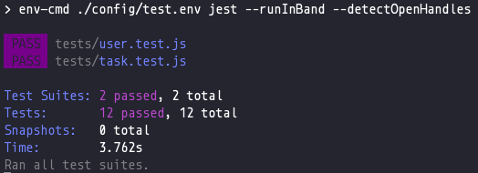

# task-manager-api

task-manager-api is a backend API for any application that requires Todo functionality. The API has two main items of importance, users and tasks. The users entity represent a person that will create various tasks. It also provides authentication so that users can only see and modify their tasks. Tasks can also be created, modified, and deleted however they are associated to the user instead of being standalone entities. The API uses MongoDB as the database and Mongoose to model the data. Lastly, the application uses various other modules to help it function. Please have a look!

## Key Items
- MongoDB
- [Mongoose](https://mongoosejs.com/)
- Express/NodeJS
- [JSON Web Token](https://www.npmjs.com/package/jsonwebtoken) 
- [Bcrypt](https://www.npmjs.com/package/bcryptjs)
- [SendGrid](https://sendgrid.com/)
- [Multer](https://www.npmjs.com/package/multer)
- Testing through [Jest](https://jestjs.io/) and [SuperTest](https://www.npmjs.com/package/supertest)

Be advised, this is an API project so in order to perform its operations you'll need to be sending HTTP Requests. Try looking at Postman as it's super simple to set up. Also, some of the endpoints will have authentication middleware so you'll need to know how to set up tokens on inbound-to-API requests.

## Installation

### Getting Started
1. Clone or download project
2. Install dependencies
      ```bash
      $ cd task-manager-api
      $ npm install
      ```
3. Installing MongoDB
  * Please find clear instructions on this [link](https://docs.mongodb.com/guides/server/install/).
  * Install Robo3T or MongoDB Atlas so that you can view your database through a GUI. These applications are pivotal to seeing your data when interacting with the API. [Robo3T](https://robomongo.org/) or [MongoDB Atlas](https://www.mongodb.com/cloud/atlas). I recommend Robot3T as it is really easy to handle. You can view what's in your database and in make changes if you need to. 

 
4. Create a config folder at the root of the project and place two env files inside: "dev.env" and "test.env". Both files should the same env variables  but with different values. The env variables are PORT, SENDGRID_API_KEY, MONGODB_URL, and JWT_SECRET. If you have never created an env file please see [video](https://www.youtube.com/watch?v=txGL-Ld9zD8). Spacing really matters in env files. 
  * __PORT__: local port you would want your application to work (ex: 300). 
  * __SENDGRID_API_KEY__: API key you receive from signing up for the free plan at [SendGrid](https://sendgrid.com/). Similar to this [video](https://www.youtube.com/watch?v=PEetQ55B9U4) but without the CandySendy part.
  * __MONGODB_URL__: This represents the URL of your localhost or production database. You will need to have a database set up to see the data (users and tasks) show up. The default URL is "mongodb://127.0.0.1:27017/task-manager-api". This should work as it's technically the default for MongoDB. The "task-manager-api" part at the end would be your application name.
  * __JWT_SECRET__: Secret represents the added value that is inputted into the hashing algorithm used to hash passwords within the API. API uses hashing on in-place and in-transit password to provide security for its users.

Once you have steps 1-4 set up, then the application should be able to run as the variables above will be placed into each of the areas needed throughout the API (ex: JWT_SECRET -> middleware/auth.js). 

5. Run API project
```bash
$ npm run dev
```

## Usage


## Testing
All necessary testing items can be found in the tests folder.
* \_\_mocks\_\_
  * mail.js: Contains mocking functions that will run instead of the original mailing functions (sending emails) so that you don't send emails over and over again. It stops annoying emails from going out when you test the API.
* fixtures
  * db.js: Contains dummy users and tasks necessary for testing. The dummy users and tasks are inserted/removed into/from the database at time of running tests. The entire file is exported to a lifecycle method in the testing suites that actually performs the inserting/removing.
  * profile-pic.jpg: just an image used for the upload avatar test.

Currently, task-manager-api has two testing suites: tests/task.test.js and tests/user.test.js

tests/task.test.js tests various endpoints concerning tasks.

tests/user.test.js tests various endpoint concerning users.

### Running tests:

1. Run

    ```bash
      $ npm test
    ```
2. You should see

   

* Potential issues:
  * Make sure database is running. If your tests are hanging that's probably it.
  * Make sure your config/test.env file is correctly configured.
  * Make sure devDependencies in package.json are installed.


## Contributing
Pull requests are welcome. For major changes, please open an issue first to discuss what you would like to change.